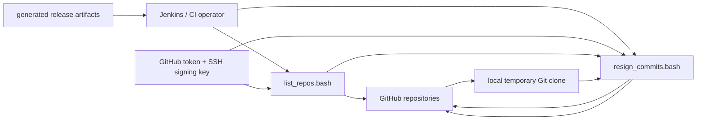

# Threat Model

## Scope and Security Objectives

The project exercises repository rewrite authority and an SSH signing key.
Its primary objectives are to keep that authority narrow, prevent accidental
signing of human or merge history, prevent stale observations from being pushed,
avoid credential disclosure through Git transport configuration, and keep
untrusted repository/ref input from becoming shell code.

## Assets

- the SSH signing private key;
- the GitHub token;
- remote branch integrity;
- author/committer provenance;
- signature validity;
- exact remote-tip expectations;
- release artifact integrity; and
- operator trust in dry-run and reporting behavior.

## Trusted Computing Base

The trusted computing base includes Bash, Git, OpenSSH/ssh-keygen, gh,
repository source, the CI/Jenkins host, and build/release dependencies according
to the authority they exercise.

Pinned bytes establish expected dependency identity, not behavioral safety.

## Trust Boundaries

The output of discovery crosses into the signer as untrusted text.  The signer
therefore validates and rechecks repositories and refs independently.

## Key Threats and Mitigations

### Branch-name spoofing

Threat: a human creates an `agent/*`, `ai/*`, or `codex/*` branch and causes
automation to treat it as trusted.

Mitigation: branch names are only discovery/routing signals.  The signer checks
author email, committer email, and parent count for the contiguous eligible
suffix.

Residual risk: configured email identity is not itself cryptographic proof of who
created the original unsigned commit.

### Rewriting human or merge history

Threat: force rewriting crosses a human or merge boundary.

Mitigation: eligibility stops at the first differently owned or multi-parent
commit.  The signer never rewrites through that boundary.

### Remote race

Threat: the remote branch changes after inspection but before push.

Mitigation: the signer performs an immediate remote-tip check and pushes with
exact `--force-with-lease=<ref>:<expected-sha>`.

Residual risk: a concurrent update may cause a safe failure/skip requiring a
later run.

### Invalid pre-existing signature

Threat: automation silently replaces a signature that cannot be verified.

Mitigation: a present-but-invalid signature causes policy rejection.

### Credential disclosure

Threat: `GH_TOKEN` is embedded into a URL or the signing key is copied into
ordinary repository state.

Mitigation: HTTPS auth uses a temporary GIT_ASKPASS file; the signer only receives
the signing-key path.  Jenkins guidance uses a private mktemp directory for key
material.

Residual risk: a compromised runner with the same process/filesystem authority
can still access credentials.

### Shell interpretation of untrusted input

Threat: repository names, ref patterns, or configuration text become shell code.

Mitigation: repository/host/pattern grammars are restricted, environment files are
parsed rather than sourced, and command arguments are quoted.

### Supply-chain dependency compromise

Threat: a build/documentation dependency executes malicious behavior.

Mitigation: bashdeps and manifest dependencies are pinned to exact released bytes
with committed SHA-256 digests; network acquisition is confined to `make deps`.

Residual risk: a correctly pinned upstream artifact may itself be malicious or
vulnerable.

## Security Evidence

- unit tests for validators, parsing, normalization, and branch-pattern handling;
- temporary-repository tests for Git history behavior;
- a live GitHub pull-request smoke test using `--dry-run`;
- Bats execution across all six executable artifacts;
- checksum verification for every release executable; and
- release validation before tag/release publication.

## Explicit Non-Goals

The project does not protect credentials from a hostile Jenkins/CI administrator
or compromised runner.  It does not determine whether signed code is semantically
safe.  It does not approve or merge pull requests.

## Review Triggers

Revisit this threat model when changing credential handling, branch eligibility,
signature verification, rewrite boundaries, force-push behavior, GitHub API
authority, runtime dependencies, logging of sensitive values, or release
publication.
